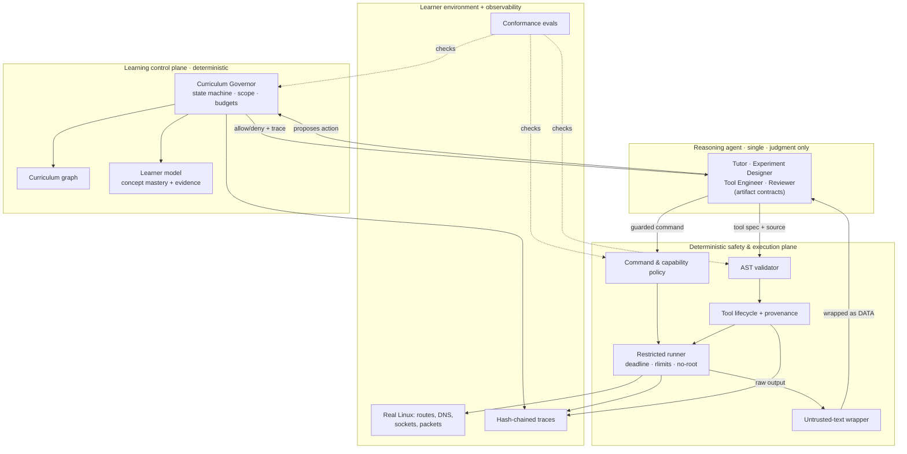

# Packet Lab

**Packet Lab is a goal-controlled agentic tutor that teaches Linux networking
and operating-system behaviour through safe experiments on the learner's own
machine.**

When a lesson needs a capability the system does not already have, the agent can
propose a narrowly scoped tool. Packet Lab validates, tests, restricts,
executes, observes, and retires that tool through a deterministic safety
pipeline.

The deeper engineering purpose: explore how an autonomous, code-generating agent
can stay useful, inspectable, measurable, and bounded while interacting with a
real operating system. The interesting part is not the agent — it is the control
around it.

---

## Project status

Early but real. The control plane, the generated-tool lifecycle, the run
tracing, and the evaluation harness are implemented and tested. The teaching
content covers ICMP, ARP, and DNS (in progress) with genuine session history.
Claims below are tagged **Implemented**, **Experimental**, or **Planned**; the
[Limitations](#limitations) section is not optional reading.

Reproducible today:

| Metric | Value | Reproduce |
|---|---|---|
| Unit tests (safety mechanisms) | **163 passing** | `./packet-lab.sh test` |
| Control-plane conformance evals | **54 passing** | `./packet-lab.sh eval` |
| End-to-end demo (real execution) | success + failure paths | `./packet-lab.sh demo` / `--failure` |
| Example run trace (hash-chain verified) | committed | `python3 -m packetlab.lab inspect --file docs/examples/trace-icmp-v1.1.jsonl --verify` |
| Resume snapshot latency (measured, no LLM) | warm ~1 ms / cold process ~45 ms | `python3 scripts/bench-resume.py` |

No model-quality benchmark, accuracy percentage, or security guarantee is
claimed — none would be reproducible, so none appear.

---

## Why this is not another AI tutor

Most "AI tutors" are a chat box with a system prompt. Packet Lab is an
engineering control system around a code-generating agent:

- **Safety is deterministic, not prompted.** Command permission, path
  containment, resource limits, and schema validation are code with tests on
  both accept and reject paths — not "be careful" instructions.
- **Generated tools are untrusted software.** Every tool the agent proposes is
  statically validated (allow-by-exception AST check on the exact bytes that
  execute), unit-tested in isolation, checksum-pinned, and invoked with typed,
  schema-validated I/O.
- **Drift is structured state, not a vibe.** A Curriculum Governor holds the
  lesson objective, scope, permitted command categories, budgets, and
  per-concept phase, and refuses actions that leave them.
- **Everything is inspectable.** Every decision, execution, and state change is a
  hash-chained JSONL trace you can inspect, re-render as a timeline, and verify
  (`lab inspect`). "Replay" here means re-rendering recorded decisions, not
  re-executing them — there is no re-execution engine.
- **Per-learner, not one global student.** Each engineer has an isolated
  profile; lessons adapt from *their own* mastery evidence, and one learner's
  state never becomes another's default.
- **Honesty is enforced.** `lab doctor` fails the build if the docs describe the
  single agent as "multi-agent", and if the curriculum graph and roadmap
  disagree.

---

## A representative lesson (real)

From the committed example (`docs/examples/`), an ICMP micro-lesson:

1. **Objective** (Governor, from `curriculum.json`): understand ICMP echo
   request/reply pairing.
2. **Prediction** (learner, recorded as evidence): "two requests, two replies,
   no loss on loopback."
3. **Experiment** (guarded command): `ping -c 2 127.0.0.1` — `governor.evaluate`
   allows it (in scope, count-bounded, within budget), `policy.check_command`
   confirms the allow-list, `runner.run_restricted` executes it under a
   wall-clock deadline. Output is wrapped as untrusted data before the agent
   reads it.
4. **Tool lookup**: no existing tool summarises ping output → the agent proposes
   `icmp-echo-summary`.
5. **Validation**: AST allow-list passes, capabilities are minimal (`network:
   none`, no commands, no filesystem), unit tests pass in an isolated temp copy,
   a sha256 is pinned.
6. **Invocation**: called with typed input; output `{"transmitted": 2,
   "received": 2, "loss_percent": 0.0}` validated against the declared schema.
7. **Explanation** (learner, recorded): "each request pairs to a reply by
   id/seq; loopback never dropped one."
8. **Mastery** (deterministic rule): observation + explanation evidence →
   concept `mastered`.

The full trace (11 events, hash-chain verified) is at
`docs/examples/trace-icmp-v1.1.jsonl`; the generated tool with its provenance is
at `docs/examples/icmp-echo-summary/`.

A **failure-and-recovery** run (`./packet-lab.sh demo --failure`) shows an
out-of-scope command denied, an unsafe tool (`import os; os.system`) rejected
before registration, the quarantine kill-switch actually removing a registered
tool (lookup and invoke both refuse it afterward), and a runaway `sleep 30`
killed at a 2-second deadline — each producing a structured, traced outcome.

---

## The learning loop

```
determine understanding → set objective → predict → design experiment
   → reuse-or-generate a tool → validate → execute (restricted) → observe
   → explain → evaluate understanding → update learner model → next lesson
```

Every transition passes through the Curriculum Governor, and every important
step emits a trace event.

---

## Architecture

One reasoning agent (the Claude Code assistant, governed by `AGENTS.md`) does the
judgment; a deterministic control plane owns everything that must not depend on a
model's good behaviour. The role names (Tutor, Experiment Designer, Tool
Engineer, Reviewer) are **artifact contracts for that one agent**, not separate
processes or models.



Full detail: [`docs/architecture.md`](docs/architecture.md).

### Agent responsibilities and boundaries

| Contract | Owns | Must not |
|---|---|---|
| **Tutor** | learner interaction, pacing, lesson progression | execute system commands directly |
| **Experiment Designer** | a structured `ExperimentSpec` | execute the experiment |
| **Tool Engineer** | a `ToolSpec` + source when reuse fails | grant itself capabilities or bypass validation |
| **Reviewer / Safety** | *this is deterministic code*, not a second model | — |
| **Learning Evaluator** | judging explanations (assistant-asserted) | claim mastery without evidence (a separate-model grader is **Planned**) |

---

## Curriculum Governor and drift prevention *(Implemented)*

Drift prevention is structured state and tested rules, not a prompt. Each lesson
in `curriculum/curriculum.json` declares its objective, in/out-of-scope concepts,
prerequisites, permitted command categories, budgets (`max_steps`,
`max_retries`, `max_generated_tools`, `max_execution_seconds`), and completion
criteria. The Governor:

- refuses out-of-scope concepts and command categories (a TCP tangent during the
  DNS lesson is denied);
- enforces per-concept phases (`theory → predicted → observed → explained`) — you
  cannot record an observation before a prediction;
- honours a student "go ahead" as a **skip waiver** that satisfies the gate
  without fabricating mastery;
- stops when a budget is exhausted, recording the stop reason;
- uses a two-phase `evaluate` (pure) / `commit` (mutator) protocol so budgets are
  neither double-counted nor never-counted;
- emits a trace event for every decision.

Detail: [`docs/curriculum-governor.md`](docs/curriculum-governor.md). Drift is
covered by `tests/test_governor.py` and the `alignment` evals.

---

## Dynamic tool lifecycle *(Implemented)*

Reuse before generation, then treat generated code as untrusted end to end:

```
lookup (reuse) → spec → validate (AST + capabilities + encoding, exact bytes)
   → test (isolated temp copy, sha256 TOCTOU guard) → register (+ provenance)
   → invoke (typed I/O, schema-checked, structured failure) → retain / quarantine / cleanup
```

Each tool carries provenance: spec, requested vs approved capabilities,
dependencies, validation findings, test results, execution history, source
checksum, retention, and status. Detail:
[`docs/tool-lifecycle.md`](docs/tool-lifecycle.md).

---

## Safety model *(Implemented, with honest limits)*

- **Deterministic policy**: argv-only (never a shell), deny-by-default command
  categories, allow-lists for the riskiest binary (tcpdump), symlink-safe path
  containment.
- **AST validation** of generated source: allow-by-exception imports, forbidden
  reflection/dynamic-execution names, gated `open()`, exact-bytes parsing that
  rejects encoding tricks. The test file is validated too.
- **Restricted runner** — *not a sandbox*: a wall-clock deadline (primary),
  rlimits (CPU/AS/FSIZE/NPROC), a scrubbed environment, `HOME` pointed at the
  workspace, refusal to run as root, and process-group SIGKILL so nothing
  lingers.
- **Two-tier enforcement, stated plainly**: for generated tools and guarded
  commands the boundary is *physical* (they run under the runner); for the agent
  itself, which has repo write access, it is *procedural and audit-detectable*
  (hash-chained traces + `inspect --verify`). See
  [`docs/threat-model.md`](docs/threat-model.md).

---

## Evaluation and observability *(Implemented)*

- **163 unit tests** over the safety mechanisms (accept + reject paths).
- **54 conformance evals** across eight categories — `alignment`, `closeout`,
  `injection`, `personalization`, `recovery`, `resume`, `teaching`, and
  `tool_safety` — testing the *enforcement points*, not model quality. A
  fixture is a JSON file, not code.
  [`docs/evaluation-strategy.md`](docs/evaluation-strategy.md).
- **Hash-chained JSONL traces**: `lab inspect <run-id>` (with `--timeline` /
  `--verify`) reconstructs a run from objective to mastery result. Replay is
  scoped to re-rendering recorded decisions, not re-execution — and says so.

---

## Learner model and mastery *(Implemented)*

Per-concept state (`unseen / in_progress / needs_review / mastered`) backed by
evidence that cites the lesson and run it came from. Mastery is derived
deterministically: it requires an observation-or-transfer entry *and* an
explanation entry; a skip never grants it. Mastery is **assistant-asserted**
(honest limitation) and human-auditable — a reviewer can diff each evidence
summary against the committed lesson narrative in `docs/lessons/`. Detail:
[`docs/learning-model.md`](docs/learning-model.md).

---

## Learner profiles and isolation *(Implemented)*

Packet Lab maintains an isolated learning model for each engineer. Lessons are
selected and adapted from that learner's own predictions, observations,
explanations, and mastery evidence. Historical runs may be retained as
anonymized examples (labelled `learner-example`), but they never become another
learner's default state.

Each learner is a local profile under `state/learners/<id>/` — separate
`profile.json`, governor state, mastery model, traces, workspace, and
generated tools. The active learner is shown in every command's output and in
every trace event, so you can never accidentally update the wrong profile.

```bash
./packet-lab.sh learner create engineer-a     # first profile becomes active
./packet-lab.sh learner create engineer-b
./packet-lab.sh learner use engineer-a
./packet-lab.sh learner list
./packet-lab.sh learner reset engineer-a --force   # destructive: needs --force
```

**Two engineers, different next steps.** After engineer A works the DNS lesson
to mastery while engineer B is new:

| | `learner show --concept dns.udp-53` | next step the tutor selects |
|---|---|---|
| **engineer-a** | `mastered` (prediction + observation + explanation on record) | skip UDP-53; move to the next DNS concept / lesson |
| **engineer-b** | `unseen` (no evidence) | run the DNS-53 experiment from the prediction step |

Lesson selection is driven by that learner's own mastery over the shared
curriculum graph — a deterministic graph plus per-learner mastery, not a
statistical recommender. What the tutor can currently adapt on: a learner's
mastered prerequisites, unseen/`needs_review` concepts, and unfinished lessons
(all derivable from their evidence). Richer signals (previous incorrect
predictions, hint usage, demonstrated transfer) are recorded as evidence and
available, but sophisticated recommendation from them is **Planned**.

This is **local profile isolation, not authentication** — see Limitations.
Detail: [`docs/learning-model.md`](docs/learning-model.md) and
[`docs/context-and-memory.md`](docs/context-and-memory.md).

---

## Context and memory *(Implemented)*

The repository is the memory: structured files (`curriculum.json`, `lesson.json`,
`learner.json`, the tool registry, run traces) rather than a growing chat log.
External text — command output, file contents, packet payloads, tool comments —
is wrapped as untrusted data (`untrusted.render`) and never silently becomes
agent instructions. Detail:
[`docs/context-and-memory.md`](docs/context-and-memory.md).

**Fast resume:** `./packet-lab.sh resume` returns a read-only snapshot of the
active learner's position (lesson, where they stopped, the one next action,
whether private preflight is worth doing) in a single call — no doctor run, no
document sweep, no network. Learner state in `state/learners/<id>/` is
canonical; assistant chat memory never is. Measured and CI-benchmarked
(`scripts/bench-resume.py`). A weekly and manually dispatchable
[`resume benchmark`](.github/workflows/resume-benchmark.yml) workflow publishes
an environment-stamped JSON report and public job summary so results stay
dated and reproducible. Detail:
[`docs/fast-resume.md`](docs/fast-resume.md).

---

## Quick start

```bash
# Prerequisites: Linux, Python 3.10+, tcpdump, git. The live viewer also needs
# python3-rich. Grant capture capability without sudo:
sudo setcap cap_net_raw,cap_net_admin+eip /usr/bin/tcpdump

git clone https://github.com/udr-w/packet-lab.git
cd packet-lab

./packet-lab.sh doctor      # health: doc caps + curriculum/roadmap consistency
./packet-lab.sh test        # 163 unit tests
./packet-lab.sh eval        # 54 conformance evals
./packet-lab.sh demo        # scripted end-to-end run (real execution)
```

Full setup: [`docs/SETUP.md`](docs/SETUP.md). Operations:
[`docs/operational-runbook.md`](docs/operational-runbook.md).

---

## Commands

```bash
./packet-lab.sh resume [--json|--verbose]  # fast read-only resume snapshot
./packet-lab.sh preflight [--json]         # private env checks for the next step
./packet-lab.sh doctor                     # health check
./packet-lab.sh test | eval | demo         # tests / evals / end-to-end demo
./packet-lab.sh viewer [mode] [iface]      # the live tcpdump-backed viewer
python3 -m packetlab.lab learner create <id>   # create + activate a learner profile
python3 -m packetlab.lab learner use|list|show|reset ...
python3 -m packetlab.lab lesson start v3.0 # begin a lesson session (active learner)
python3 -m packetlab.lab record prediction <concept> --text "..."
python3 -m packetlab.lab run --category dns_query -- dig +short example.com
python3 -m packetlab.lab experiment validate --spec <experiment.json>
python3 -m packetlab.lab tool lookup|validate|invoke|list|cleanup ...
python3 -m packetlab.lab learner show [--concept <id>]
python3 -m packetlab.lab inspect [<run-id> | --file <trace>] [--timeline|--verify]
```

The learner also drives lessons conversationally — see the Student Commands
below.

---

## Repository structure

```
packetlab/
  lab/              control plane (stdlib only): specs, policy, governor,
                    curriculum, learner, runner, astcheck, toolgen, trace,
                    untrusted, statefile, cli, doctor, demo
  capture.py parser.py resolver.py stats.py ui.py   # the live packet viewer
scripts/            viewer entry (packetlab.py) + lab-doctor size caps
curriculum/         curriculum.json (the 12-version graph)
tests/              unit tests for the safety mechanisms
evals/              conformance evals + JSON fixtures
docs/               architecture, threat-model, tool-lifecycle, curriculum-
                    governor, learning-model, evaluation-strategy, context-and-
                    memory, operational-runbook, contributing, adr/, lessons/,
                    knowledge/, examples/
```

---

## Design decisions

Concise ADRs in [`docs/adr/`](docs/adr/): why an agent at all; why safety is
deterministic and generated tools are untrusted; why reuse precedes generation;
why learner evaluation is separated (and its limits); why traces are structured
and hash-chained; why state is JSON files under a lock; why a restricted runner
now and namespace isolation is a documented gap; why one agent with role
contracts rather than a multi-agent design.

---

## Threat model summary

Generated malicious code, accidental destructive commands, prompt injection via
output/files/payloads, secret leakage, filesystem traversal, resource
exhaustion, persistent malicious tools, state/log tampering, unsafe concurrency,
and capture privacy — each with its asset, path, mitigation, **residual
exposure**, and planned improvement in
[`docs/threat-model.md`](docs/threat-model.md).

---

## Limitations

- **Linux-only**; the lessons are specifically about Linux networking.
- Some packet experiments need capabilities (`CAP_NET_RAW`) not available in
  every environment.
- The runner is **resource limits + a scrubbed environment + process-group kill,
  not an isolation boundary** — no namespaces, seccomp, or kernel-enforced
  network cut-off. AST validation is therefore load-bearing, and it reduces risk
  rather than proving safety.
- For the agent itself (which has repo write access) the control-plane boundary
  is procedural and audit-detectable, not physically enforced.
- Mastery evaluation is **assistant-asserted and probabilistic**; there is no
  independent grader (Planned).
- Command output varies across distributions; tools parse defensively but can
  meet unfamiliar formats.
- Packet capture may expose sensitive traffic; captures are gitignored and the
  operator is responsible for deleting them.
- `network: none` on a tool is currently enforced statically (no socket imports
  pass the AST), not by the kernel.
- **Learner profiles are local, not authenticated.** Isolation is by directory
  namespace under `state/learners/<id>/`; anyone with access to the local state
  directory can read or switch any local profile. There is no multi-user
  authentication, hosted tenancy, collaborative classroom, or cloud
  synchronization — none is claimed or implemented.

---

## Roadmap

Twelve versions (`ROADMAP.md`): ICMP ✔, ARP ✔, DNS (in progress), then TCP, UDP,
TLS, HTTP, Linux routing, Docker networking, network namespaces, VPN, and an
interactive explorer. Control-plane roadmap items (all **Planned**, tracked in
the threat model and ADRs): unprivileged namespace isolation for generated
tools; a separate-model learning evaluator; a trace-audit eval over real lesson
traces; signed tool provenance; human-approval prompts for mutating commands.

---

## Contributing

Boundaries first: stdlib only for the control plane, files under 500 lines,
atomic locked state writes, no new root requirements, safety-sensitive code
tested on both accept and reject paths, and the single-agent terminology
enforced by `lab doctor`. See [`docs/contributing.md`](docs/contributing.md).

---

## Student Commands

The learner drives lessons in natural language; these keep every session
on-scope and drift-free (backed by the `AGENTS.md` **Pacing** rules and,
increasingly, by the Curriculum Governor's structured state):

| Command | What it does |
|---|---|
| `resume lesson` | Fast resume: acknowledges immediately, loads the snapshot (`./packet-lab.sh resume`), recaps in two sentences, asks one focused question. See [`docs/fast-resume.md`](docs/fast-resume.md). |
| `scope?` | Lists tonight's declared step list; anything outside it is drift. |
| `go ahead` / `move on` | Skips the current question in the same message (a skip waiver — never counted as mastery). |
| `curiosity` | A short, complete detour, then straight back to the roadmap. |
| `quiz me` | A conceptual quiz favouring reasoning over memorization. |
| `end lesson for today` | Archives the lesson, distills knowledge, updates state, health-checks, commits and pushes. |
| `reset progress` | Restarts the whole program from Version 1 (asks to confirm; archives history). |
