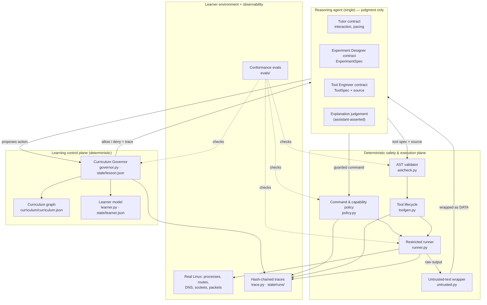

# Architecture

Packet Lab is a goal-controlled agentic tutor for Linux networking. One
reasoning agent does the judgment; a deterministic control plane owns
everything that must not depend on a model's good behaviour: safety, state,
budgets, and observability.

This document describes what actually runs, where the boundaries are, and —
just as important — where they are *not*.

## The one honest sentence about "agents"

There is a single reasoning agent: the Claude Code assistant, operating under
the rules in `AGENTS.md`. The role names you will see (Tutor, Experiment
Designer, Tool Engineer, Reviewer, Learning Evaluator) are **artifact
contracts for that one agent**, not separate processes and not separate models.
The agent produces structured artifacts (a lesson decision, an experiment spec,
a tool spec + source, an evidence record); the control plane decides whether
each artifact may act and records what happened. There is no multi-agent
runtime, no message bus, and no in-repo model call.

Why an agent at all, and not a script? Because the work that genuinely needs
judgment — planning the next lesson, adapting an explanation to a specific
misconception, designing a novel experiment, deciding whether a learner's
answer shows causal understanding — has no deterministic implementation. Where
a task *does* have one (permission checks, path validation, budgets, schema
checks, state transitions, audit logging, cleanup), the repository uses code,
not a model. See `docs/adr/0001-why-an-agent.md`.

## Four planes

### 1. Learning control plane

Owns the curriculum graph, the lesson objective and its scope, and the
concept-level learner model. It answers "what should we be learning, and are we
staying on it?" See `docs/curriculum-governor.md` and `docs/learning-model.md`.

- `curriculum/curriculum.json` — the 12-version graph, the machine-authoritative
  twin of `ROADMAP.md`. `lab doctor` fails if the two disagree.
- `governor.py` — the **Curriculum Governor**: the lesson state machine, scope
  checks, and budgets. Drift prevention is this structured state plus tested
  rules, not a prompt.
- `learner.py` — per-concept mastery backed by evidence that cites the lesson
  and run it came from.

### 2. Reasoning agent

The single agent, acting through role contracts. It never executes a system
command directly; it proposes one to the Governor and the policy layer, which
run it under the restricted runner. Its tool ideas are untrusted source that
must pass the AST validator and its own unit tests before it can invoke them.

### 3. Deterministic safety & execution plane

Owns every safety-sensitive decision. Agents cannot bypass it *for the things
it physically controls* — guarded commands and generated tools run under
`runner.py`, and generated source must pass `astcheck.py`. See
`docs/threat-model.md` for the precise, two-tier boundary statement.

- `policy.py` — command categories, per-binary allow/deny rules (allow-lists
  for the riskiest binary, tcpdump), capability checks, symlink-safe path
  containment. Argv only; there is no shell anywhere.
- `astcheck.py` — allow-by-exception static validation of generated source.
- `runner.py` — restricted subprocess execution: a wall-clock deadline as the
  primary time control, rlimits as backstops, a scrubbed environment, no root,
  and process-group termination so nothing outlives a run.
- `toolgen.py` — the generated-tool lifecycle with byte-exact validation,
  sha256 TOCTOU guards, and full provenance.
- `untrusted.py` — wraps external text as data so an "ignore your instructions"
  string in captured output reads as quoted data, not a directive.

### 4. Learner environment + observability

The specimen is the learner's real machine — processes, routes, DNS, sockets,
packets — observed through guarded commands. Every important action is recorded
as a hash-chained JSONL trace (`trace.py`), inspectable with `lab inspect` and
verifiable with `lab inspect --verify`. The conformance evals (`evals/`)
exercise the enforcement points against fixtures.

## The lesson loop, concretely

1. **Governor** establishes the objective, scope, permitted command categories,
   and budgets from `curriculum.json`, and mints a run id.
2. **Agent** (Tutor) states scope and asks the learner to predict; the
   prediction is recorded as learner evidence and advances the concept's phase.
3. **Agent** (Experiment Designer) proposes an experiment; the guarded command
   flows `governor.evaluate → policy.check_command → runner.run_restricted`, and
   its output is wrapped as untrusted data before the agent interprets it.
4. If a capability is missing, **reuse is tried first** (`toolgen.lookup`); only
   on a miss does the Tool Engineer produce a `ToolSpec` + source, which is
   validated, unit-tested in isolation, registered with provenance, and invoked
   with typed inputs and schema-checked output.
5. **Agent** asks the learner to explain; the explanation is recorded, and the
   deterministic `_derive_state` rule decides whether the concept is mastered.
6. The **Governor** closes the lesson only when the curriculum's completion
   criteria are confirmed, or aborts with a recorded reason.

Every step above emits a trace event, so the whole run is replayable from
objective to mastery result. A worked example is committed at
`docs/examples/trace-icmp-v1.1.jsonl` (verify it with
`lab inspect --file docs/examples/trace-icmp-v1.1.jsonl --verify`, or read the
generated tool at `docs/examples/icmp-echo-summary/`).

## What is deterministic vs judgment

| Deterministic (code)                         | Judgment (agent)                    |
|----------------------------------------------|-------------------------------------|
| Permission & capability checks               | Lesson planning                     |
| Path validation, workspace confinement       | Adapting an explanation             |
| Resource limits, timeouts, output caps       | Designing a novel experiment        |
| Schema validation (spec, inputs, outputs)    | Writing a missing tool's spec/code  |
| Lesson state transitions & budgets           | Judging a learner's explanation     |
| Audit logging & hash-chained traces          | Selecting the next challenge        |
| Tool registration, cleanup, quarantine       |                                     |

## Boundaries, stated plainly

- The runner is a **restricted runner**, not a sandbox: rlimits + process-group
  kill + scrubbed env, with **no namespace, seccomp, or network isolation**.
- For **generated tools and guarded commands**, the control plane is a *physical*
  boundary — they genuinely run under `runner.py` with the AST validator in
  front.
- For **the agent itself**, which has repository write access, the boundary is
  *procedural and audit-detectable*: hash-chained traces plus
  `lab inspect --verify` make an out-of-band state edit detectable, but nothing
  physically stops the agent from writing a state file. `AGENTS.md` makes "act
  through the CLI" a standing rule; the verifier is the check.

These limits are not incidental — they are the honest edge of the design, and
`docs/threat-model.md` treats each as a threat with a mitigation and a residual.

## Technology

Python 3.10, standard library only for `packetlab/lab/`. Rich is used only by
the live viewer (`scripts/packetlab.py`). State is plain JSON files written
atomically under an advisory lock. No database, no services, no external model
dependency in the control plane.
